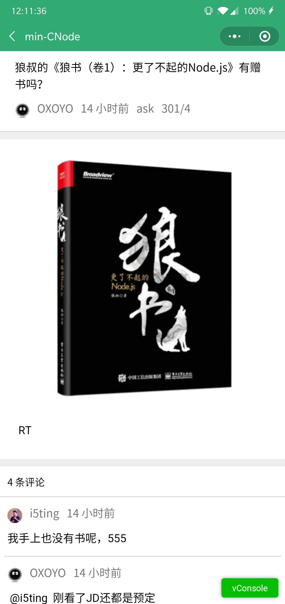
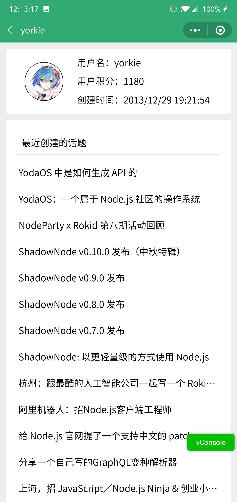
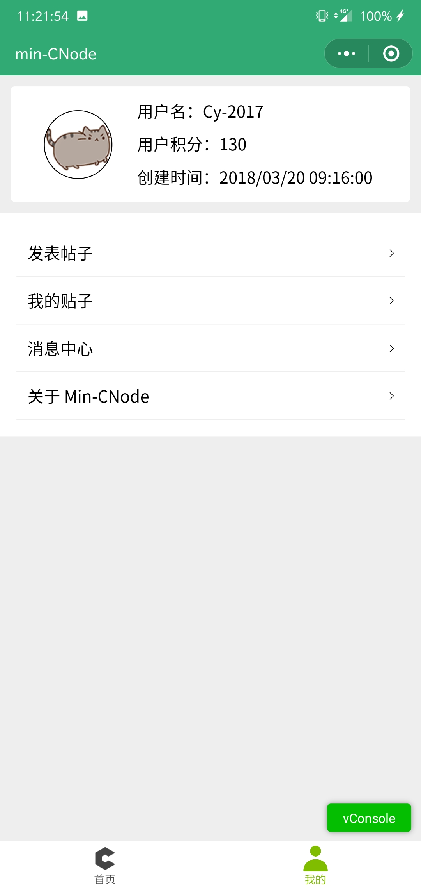

# min-CNode

Browse CNode Forum on wechat.

# screen

<table class="tb">
  <thead>
    <tr>
      <th class="ct">index</th>
      <th class="ct">topic</th>
      <th class="ct">user</th>
    </tr>
  </thead>
  <tbody>
    <tr>
      <th></th>
      <th></th>
      <th></th>
    </tr>
  </tbody>
</table>

<table class="tb">
  <thead>
    <tr>
      <th class="ct">no-me</th>
      <th class="ct">me</th>
    </tr>
  </thead>
  <tbody>
    <tr>
      <th></th>
      <th></th>
    </tr>
  </tbody>
</table>